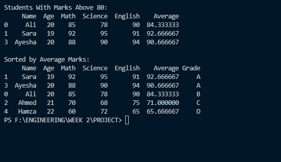

# 📊 Student Performance Analysis

This project analyzes student performance using **Python** and **Pandas**. It reads student data from a CSV file, performs various analyses, and generates meaningful insights such as average marks, grades, and top-performing students.

## 🚀 Features

- Read student data from a CSV file
- Display dataset information
- Calculate average marks for each student
- Assign grades (A, B, C, D)
- Identify top and lowest-performing students
- Filter students based on average marks
- Sort students by performance
- Export the final results to a new CSV file

## 🛠️ Technologies Used

- Python
- Pandas

## 📂 Project Structure

- `students.csv` – Input dataset
- `student_analysis.py` – Main analysis script
- `student_results.csv` – Output file with analysis

## ▶️ How to Run

```bash
pip install pandas
python student_analysis.py
```
## 📷 Sample Output


## 📌 Learning Objectives

This project was created to practice fundamental Pandas concepts, including:
- DataFrames
- Reading CSV files
- Filtering data
- Sorting
- Adding new columns
- Exporting CSV files
